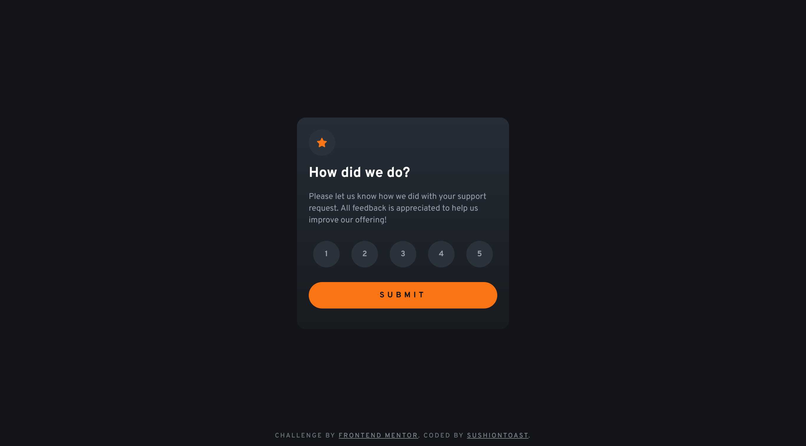

# Frontend Mentor - Interactive rating component solution

This is a solution to the [Interactive rating component challenge on Frontend Mentor](https://www.frontendmentor.io/challenges/interactive-rating-component-koxpeBUmI). Frontend Mentor challenges help you improve your coding skills by building realistic projects. 

## Table of contents

- [Overview](#overview)
  - [The challenge](#the-challenge)
  - [Screenshot](#screenshot)
  - [Links](#links)
- [More information](#more-information)
  - [Built with](#built-with)
  - [Useful resources](#useful-resources)
- [Author](#author)

## Overview

### The challenge

Users should be able to:

- View the optimal layout for the app depending on their device's screen size
- See hover states for all interactive elements on the page
- Select and submit a number rating
- See the "Thank you" card state after submitting a rating

### Screenshot

### Links

- Solution URL: [Available on github pages](#)

## More information

### Built with

- Semantic HTML5 markup
- CSS
- JavaScript

### Useful resources

- [W3schools](https://www.w3schools.com/css/) - Helped me with styling certain elements
- [MDN web docs](https://developer.mozilla.org/en-US/) - Helped me a lot with the fetch API and a great general reference

## Author

- Frontend Mentor - [@SushiOnToast](https://www.frontendmentor.io/profile/SushiOnToast)
- CodePen - [@SushiOnToast](https://codepen.io/SushiOnToast)
- CodeWars - [@SushiOnToast](https://www.codewars.com/users/SushiOnToast)
